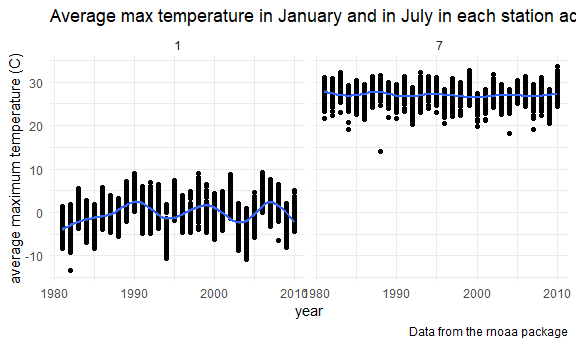
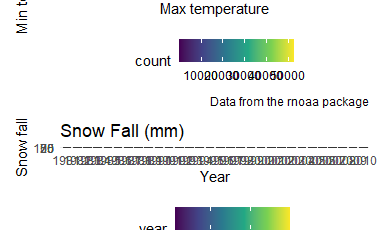

p8105\_hw3\_yx2640
================
Elaine Xu
2020/10/10

### Problem 1

``` r
data("instacart")
```

This dataset contains 1384617 rows and 15 columns.

Observations are the level of items in orders by user. There are user /
order variables – user ID, order ID, order day, and order hour. There
are also item variables – name, aisle, department, and some numeric
codes.

There are 134 aisles, most items are from fresh vegetables.

``` r
instacart %>% 
    count(aisle) %>% 
    arrange(desc(n))
```

    ## # A tibble: 134 x 2
    ##    aisle                              n
    ##    <chr>                          <int>
    ##  1 fresh vegetables              150609
    ##  2 fresh fruits                  150473
    ##  3 packaged vegetables fruits     78493
    ##  4 yogurt                         55240
    ##  5 packaged cheese                41699
    ##  6 water seltzer sparkling water  36617
    ##  7 milk                           32644
    ##  8 chips pretzels                 31269
    ##  9 soy lactosefree                26240
    ## 10 bread                          23635
    ## # ... with 124 more rows

Let’s make a plot

``` r
instacart %>% 
    count(aisle) %>% 
    filter(n > 10000) %>% 
    mutate(
        aisle = factor(aisle),
        aisle = fct_reorder(aisle, n)
    ) %>% 
    ggplot(aes(x = aisle, y = n)) + 
    geom_point() + 
    theme(axis.text.x = element_text(angle = 90, vjust = 0.5, hjust = 1))
```


Let’s make a table\!\!

``` r
instacart %>% 
    filter(aisle %in% c("baking ingredients", "dog food care", "packaged vegetables fruits")) %>% 
    group_by(aisle) %>% 
    count(product_name) %>% 
    mutate(rank = min_rank(desc(n))) %>% 
    filter(rank < 4) %>% 
    arrange(aisle, rank) %>% 
    knitr::kable()
```

| aisle                      | product\_name                                 |    n | rank |
| :------------------------- | :-------------------------------------------- | ---: | ---: |
| baking ingredients         | Light Brown Sugar                             |  499 |    1 |
| baking ingredients         | Pure Baking Soda                              |  387 |    2 |
| baking ingredients         | Cane Sugar                                    |  336 |    3 |
| dog food care              | Snack Sticks Chicken & Rice Recipe Dog Treats |   30 |    1 |
| dog food care              | Organix Chicken & Brown Rice Recipe           |   28 |    2 |
| dog food care              | Small Dog Biscuits                            |   26 |    3 |
| packaged vegetables fruits | Organic Baby Spinach                          | 9784 |    1 |
| packaged vegetables fruits | Organic Raspberries                           | 5546 |    2 |
| packaged vegetables fruits | Organic Blueberries                           | 4966 |    3 |

Apples vs ice cream..

``` r
instacart %>% 
    filter(product_name %in% c("Pink Lady Apples", "Coffee Ice Cream")) %>% 
    group_by(product_name, order_dow) %>% 
    summarize(mean_hour = mean(order_hour_of_day)) %>% 
    pivot_wider(
        names_from = order_dow,
        values_from = mean_hour
    ) %>% 
    knitr::kable()
```

    ## `summarise()` regrouping output by 'product_name' (override with `.groups` argument)

| product\_name    |        0 |        1 |        2 |        3 |        4 |        5 |        6 |
| :--------------- | -------: | -------: | -------: | -------: | -------: | -------: | -------: |
| Coffee Ice Cream | 13.77419 | 14.31579 | 15.38095 | 15.31818 | 15.21739 | 12.26316 | 13.83333 |
| Pink Lady Apples | 13.44118 | 11.36000 | 11.70213 | 14.25000 | 11.55172 | 12.78431 | 11.93750 |

### Problem 2

**Load, tidy, and otherwise wrangle the data.**

``` r
accel =
  read_csv(
        "./data/accel_data.csv"
        ) %>%
  janitor::clean_names() %>%
  pivot_longer(
    activity_1:activity_1440,
    names_to = "minute",
    values_to = "activity_ct") %>%
  mutate(
    day_num = recode(day, "Sunday" = "7", "Saturday" = "6", "Friday" = "5", "Monday" = "1", "Tuesday" = "2", "Wednesday" = "3", "Thursday" = "4")) %>%
  arrange(week, day_num) %>%
  select(-day_num) %>%
  mutate(
    weekday_vs_weekend = case_when(
    day %in% c("Monday","Tuesday","Wednesday","Thursday","Friday") ~ "weekday",
    day %in% c("Saturday","Sunday") ~ "weekend")) %>%
  mutate(
    day = as.factor(day))
```

    ## Parsed with column specification:
    ## cols(
    ##   .default = col_double(),
    ##   day = col_character()
    ## )

    ## See spec(...) for full column specifications.

This data collected five weeks of accelerometer data on a 63 year-old
male with BMI 25. After tidy the original data, the resulting dataset
has 50400 observations and 6 variables. Day of the week is the only
factor class variable. Other then `day`, variables `week`, `day_id` and
`activity_ct` are class `numeric`, and variables `minute` and
`weekday_vs_weekend` are class `character`. Variable `minute` collected
1440 minutes of each day in the `day` variable over five weeks.

**Aggregate accross minutes to create a total activity variable for each
day, and create a table showing these totals.**

``` r
total_active = accel %>%
    group_by(week, day) %>%
    count(sum(activity_ct)) %>%
  janitor::clean_names() 

total_active_table = total_active%>%
  mutate(
    day = as.character(day),
    day_num = recode(day, "Sunday" = "7", "Saturday" = "6", "Friday" = "5", "Monday" = "1", "Tuesday" = "2", "Wednesday" = "3", "Thursday" = "4")) %>%
  arrange(week, day_num) %>%
  select(-day_num, -n) %>%
  pivot_wider(names_from = day, values_from = sum_activity_ct)

knitr::kable(total_active_table)
```

| week |    Monday |  Tuesday | Wednesday | Thursday |   Friday | Saturday | Sunday |
| ---: | --------: | -------: | --------: | -------: | -------: | -------: | -----: |
|    1 |  78828.07 | 307094.2 |    340115 | 355923.6 | 480542.6 |   376254 | 631105 |
|    2 | 295431.00 | 423245.0 |    440962 | 474048.0 | 568839.0 |   607175 | 422018 |
|    3 | 685910.00 | 381507.0 |    468869 | 371230.0 | 467420.0 |   382928 | 467052 |
|    4 | 409450.00 | 319568.0 |    434460 | 340291.0 | 154049.0 |     1440 | 260617 |
|    5 | 389080.00 | 367824.0 |    445366 | 549658.0 | 620860.0 |     1440 | 138421 |

There is no obvious trends just by looking at the table. For example,
the Monday of the first week has the least activities, but in the
following four weeks, Monday has a relatively higher activity counts
compared with other days. There was little activity on the Saturday of
the fourth and fifth weeks, but on the Saturday of the second week,
activity counts reached its highest level of the week.

**Make a single-panel plot**

``` r
accel %>%
  ggplot(aes(x = minute, y = activity_ct)) +
  geom_point(aes(color = day)) +
  labs(
    title = "24-hour activity time",
    x = "Minute of each day",
    y = "Activity of each minute",
    caption = "Data from the rnoaa package") +
  geom_smooth(alpha = 0.5)
```

    ## `geom_smooth()` using method = 'loess' and formula 'y ~ x'


From the graph we can see that on Saturday, this male has least activity
compared with the other six days. This may be due to the lack of data
records, or it may be because he really has no activity. In terms of
point dispersion, there was more activity per minute on Friday and
Wednesday. It can be seen from the figure that the amount of activity in
the middle period is generally low, which indicates that the man is
likely sleeping during this period.

### Problem 3

``` r
data("ny_noaa")
```

**Data cleaning**

``` r
my_ny_noaa = ny_noaa %>%
  separate(date, into = c("year", "month", "day"), convert = TRUE) %>%
  arrange(year, month) %>%
  mutate(
    prcp = as.numeric(prcp/10),
    tmax = as.numeric(tmax)/10,
    tmin = as.numeric(tmin)/10
  )

snow_obs = my_ny_noaa %>%
    count(snow) %>% 
    arrange(desc(n))
```

This data collected weather data from all New York state weather
stations from January 1, 1981 through December 31, 2010. After tidy the
original data, the resulting dataset has 2595176 observations and 9
variables. All variables are class `numeric` or `integer`. We separate
the date into `year`, `month` and `day` so that the data can then be
analyzed in terms of months. The unit for precipitation was “tenths of
mm”, same as `tmax` and `tmin`which maximum temperature and minimum
temperature were both in the unit of “tenths of degrees C”. We divided
both data by ten, to let their unit can be easier compared with other.

We can find that there is a certain amount of missing data for variables
other than station ID and date. The absence of such data may reduce
statisticl power and the representativeness of the samples. Due to the
missing data, we may not be able to have a more accurate analysis of the
trend of temperature, snowfall and other data.

For snowfall, the most commonly observed value is 0. Since winter takes
up only a quarter of the year, and most of the time there’s no snow.

**Make a two-panel plot**

``` r
Jan_vs_July = my_ny_noaa %>%
  filter(month %in% c("1", "7")) %>%
  group_by(id, year, month) %>%
  summarise(average_tmax = mean(tmax))
```

    ## `summarise()` regrouping output by 'id', 'year' (override with `.groups` argument)

``` r
  ggplot(Jan_vs_July, aes(x = year, y = average_tmax)) +
  geom_point() +
  geom_smooth() +
  facet_grid(. ~ month) +
  labs(
    title = "Average max temperature in January and in July in each station across years",
    x = "year",
    y = "average maximum temperature (C)",
    caption = "Data from the rnoaa package")
```

    ## `geom_smooth()` using method = 'gam' and formula 'y ~ s(x, bs = "cs")'

    ## Warning: Removed 7058 rows containing non-finite values (stat_smooth).

    ## Warning: Removed 7058 rows containing missing values (geom_point).



As can be seen from the figure above, the highest temperature in January
is much lower than the highest temperature in July. This is because
January is still winter and the temperature is much lower than July,
which is in summer. By looking at the overall trend, the highest
temperatures in January vary widely from year to year. The fluctuation
of temperature is wavy, decreasing year by year and then beginning to
rise year by year.The July maximum temperatures were a bit less
variable. There is outliers showing in July where the temperature is
abnormally low, this could be because the monitoring station recorded
data wrong.

**Make a two-panel plot showing (i) tmax vs tmin for the full dataset
and (ii) make a plot showing the distribution of snowfall values greater
than 0 and less than 100 separately by year.**

``` r
# tmax vs tmin bin plot
max_min =  my_ny_noaa %>%
  ggplot(aes(x = tmax, y = tmin)) + 
  geom_hex() +
  labs(
    title = "Max and min temperature comparison",
    x = "Max temperature",
    y = "Min temperature",
    caption = "Data from the rnoaa package")

# make a plot showing the distribution of snowfall values greater than 0 and less than 100 separately by year
dis_snow = my_ny_noaa %>%
  filter(snow > 0 & snow < 100) %>%
  group_by(year) %>%
  ggplot(aes(x = factor(year), y = snow, fill = year)) +
  geom_boxplot() +
  labs(
    title = "Snow Fall (mm)",
    x = "Year",
    y = "Snow fall",
    caption = "Data from the rnoaa package")

(max_min/dis_snow)
```

    ## Warning: Removed 1136276 rows containing non-finite values (stat_binhex).



From the bin plot we can see that most of the time the temperature is
around 0 to 25 degrees. Snowfall is quite even for these 20 years. The
25% quantile and 75% quantile are quite similar, and they also have
similar median.
